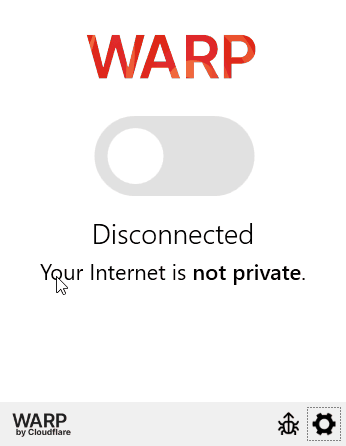

# Cloudflare Warp

Cloudflare Warp is a recursive DNS that tunnels your connection to the nearest Cloudflare data center where it can then be routed to the desired destination.  Instead of bouncing through a VPN or an ISP DNS service, Cloudflare will do the routing.  This can increase your connectivity to the game's servers.\


**Installation Guide**

1. In your preferred browser, navigate to [https://1.1.1.1](broken-reference)
2. Choose your operating system to start the download.

<figure><figcaption></figcaption></figure>

**Windows**

1. Once complete, navigate to your downloads folder (C:\Users\\\<YourUsername>\Downloads).  You should see a file called "Cloudflare\_WARP\_Release-x64.msi".  Double click this to install.
2. In the installer, click Next and then "Install".  When complete, click "Finish".
3. On your System Tray in the bottom right, you should see a gray cloud icon.  If you don't, you might have to click the up arrow to show more icons.\
   \

4. Click on the cloud icon.  For first time installs, you will get a notification about Cloudflare Warp.  Click Next and then accept.\
   .png>)
5. Once the Warp is setup, it will say "Disconnected" under the slide button.  Click on the big slide button to turn it on.\
   \

6. Once it is on, you are all set!\


**Linux**

Follow instructions below for your distro.\
\
**Ubuntu**\
\
**The following releases are the only ones supported.  Other versions may result in a 404 when trying to update and install Cloudflare Warp.**

* Jammy (22.04)
* Focal (20.04)
* Bionic (18.04)
* Xenial (16.04)

1.  Make sure your system is up to date by running the following commands.  Reboot after updating and upgrading.\


    ```
    sudo apt-get dist-upgrade
    sudo apt-get update && sudo apt-get upgrade
    ```

    \

2.  Run the following commands:\
    \


    ```
    sudo su
    ```

    \


    ```
    curl https://pkg.cloudflareclient.com/pubkey.gpg | sudo gpg --yes --dearmor --output /usr/share/keyrings/cloudflare-warp-archive-keyring.gpg
    ```

    \


    ```
    echo "deb [arch=amd64 signed-by=/usr/share/keyrings/cloudflare-warp-archive-keyring.gpg] https://pkg.cloudflareclient.com/ $(lsb_release -cs) main" | sudo tee /etc/apt/sources.list.d/cloudflare-client.list
    ```

    \


    ```
    sudo apt-get update && sudo apt-get install cloudflare-warp
    ```


**Debian**

**The following releases are the only ones supported.  Other versions may result in a 404 when trying to update and install Cloudflare Warp.**

* Bookworm (12)
* Bullseye (11)
* Buster (10)
* Stretch (9)

1.  Make sure your system is up to date by running the following commands.  Reboot after updating and upgrading.\


    ```
    sudo apt-get dist-upgrade
    sudo apt-get update && sudo apt-get upgrade
    ```
2.  Run the following commands:\


    ```
    sudo su
    ```


    ```
    curl https://pkg.cloudflareclient.com/pubkey.gpg | sudo gpg --yes --dearmor --output /usr/share/keyrings/cloudflare-warp-archive-keyring.gpg
    ```

    \


    ```
    echo "deb [arch=amd64 signed-by=/usr/share/keyrings/cloudflare-warp-archive-keyring.gpg] https://pkg.cloudflareclient.com/ $(lsb_release -cs) main" | sudo tee /etc/apt/sources.list.d/cloudflare-client.list
    ```

    \


    ```
    sudo apt-get update && sudo apt-get install cloudflare-warp
    ```


**Red Hat/CentOS**

1.  Run the following commands (**Please note, the support Yum version is 8)**:\
    \


    ```
    curl -fsSl https://pkg.cloudflareclient.com/cloudflare-warp-ascii.repo | sudo tee /etc/yum.repos.d/cloudflare-warp.repo
    ```

    \


    ```
    sudo yum update
    ```

    \


    ```
    sudo yum install cloudflare-warp
    ```

    \
