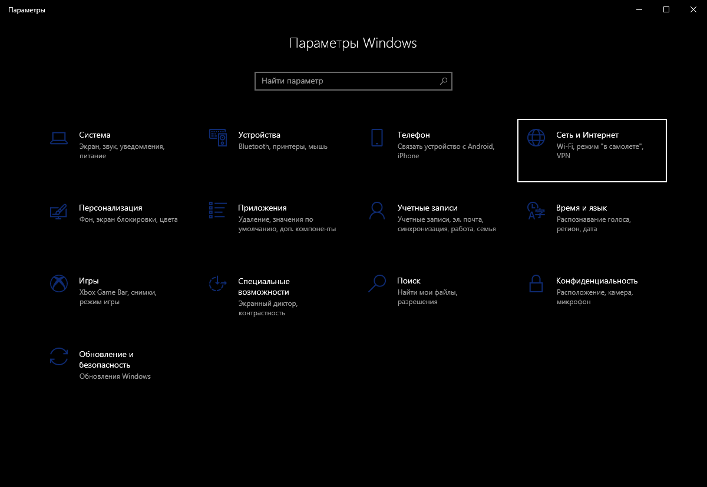
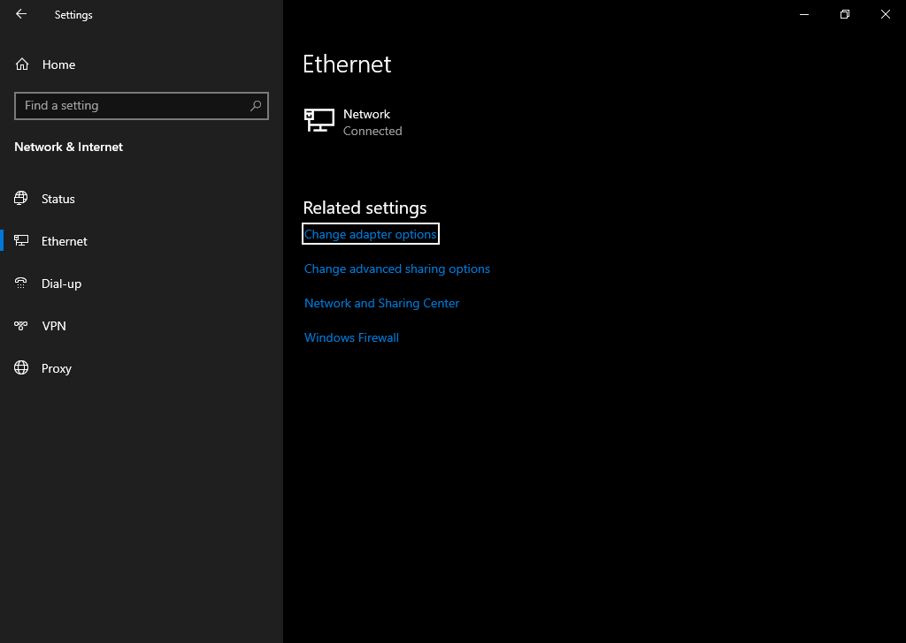
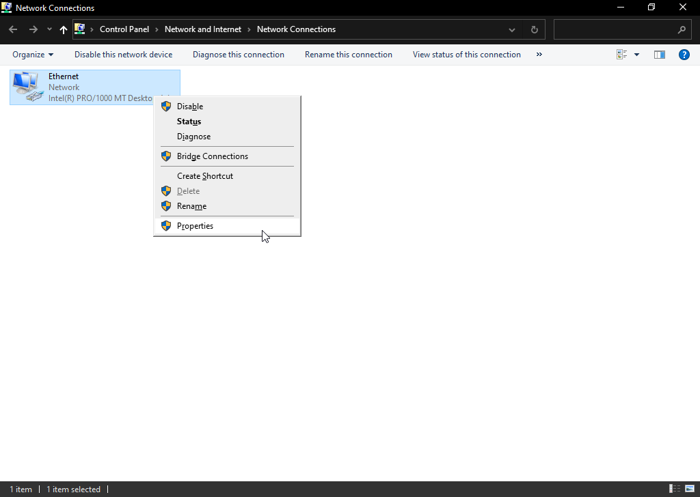
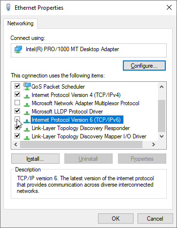

# Invalid IPv6

Dacă ești blocat la conexiunea cu serverul principal și atunci când dai ping la `api.battlebit.cloud` îți arată ca IPv6 invalid, urmează următoarele:

Windows 10

1. Apasă pe "Network & Internet" în setări Windows.

2. Depinzând de tipul tău de conexiune selectează Wifi sau Ethernet la "Change adapter options".

3. Apasă click dreapta la adaptatorul tău principal și selectează "proprieties"

4. Dezactivează "Internet Protocol Version 6 (TCP/IPv6)" și apasă OK.

Windows 11

1. Apasă pe "Network & Internet" în setări Windows.

2. Apasă pe "Advanced Network Settings"

3. Dă scroll jos si apasă pe "More network adapter options".

4. Apasă click dreapta pe conexiunea ta de internet, apoi apasă "Properties".

4. Dezactivează "Internet Protocol Version 6 (TCP/IPv6)" și apasă OK.

