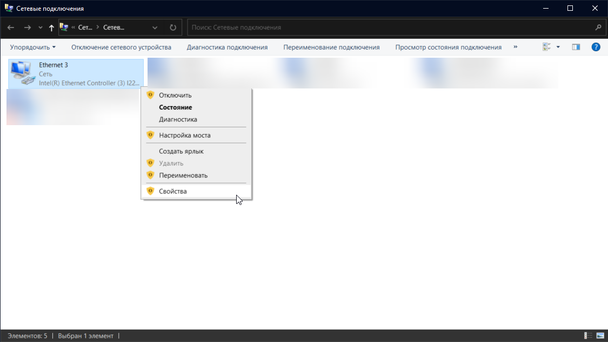

# Adresse IPv6 invalide

Si vous êtes bliqués sur connection au server principal, et que `api.battlebit.cloud` retourne une erreur de type adresse IPv6 invalide , suivez:

Windows 10

1. Cliquez sur "Réseau & Internet" dans les paramètres Windows.

2. Selon votre type de connection, selectionnez Wifi ou Ethernet sur "Changer les options de l'adaptateur".

3. Clic droit sur votre adaptateur principal et sélectionnez propritétés.

4. Désactivez "Internet Protocol Version 6 (TCP/IPv6)" et validez.

Windows 11

1. Cliquez sur "Réseau & Internet" dans les paramètres Windows.

2. Cliquez sur "Paramètres réseau avancés"

3. Descendez et cliquez sur "More network adapter options".

4. Right-Cliquez sur connection internet et cliquez sur "Propriétés".

4. Désactivez "Internet Protocol Version 6 (TCP/IPv6)" et validez.

