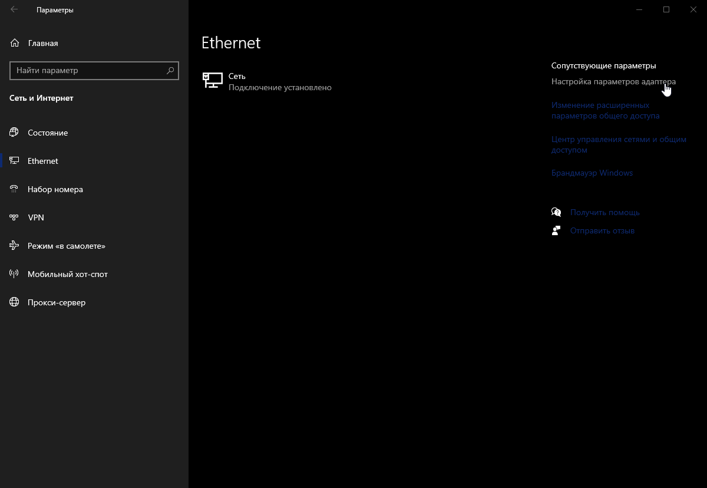
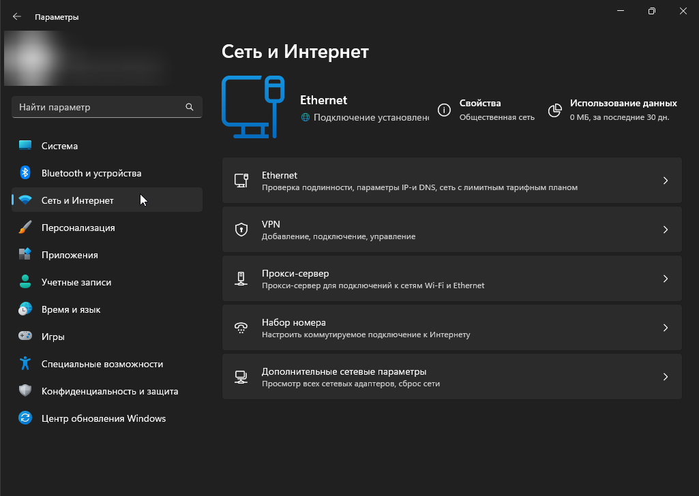
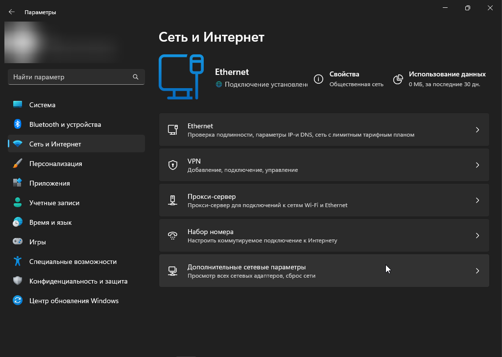
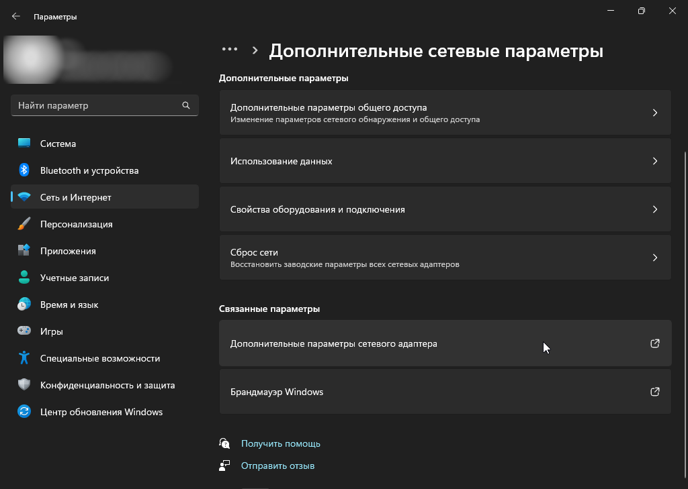
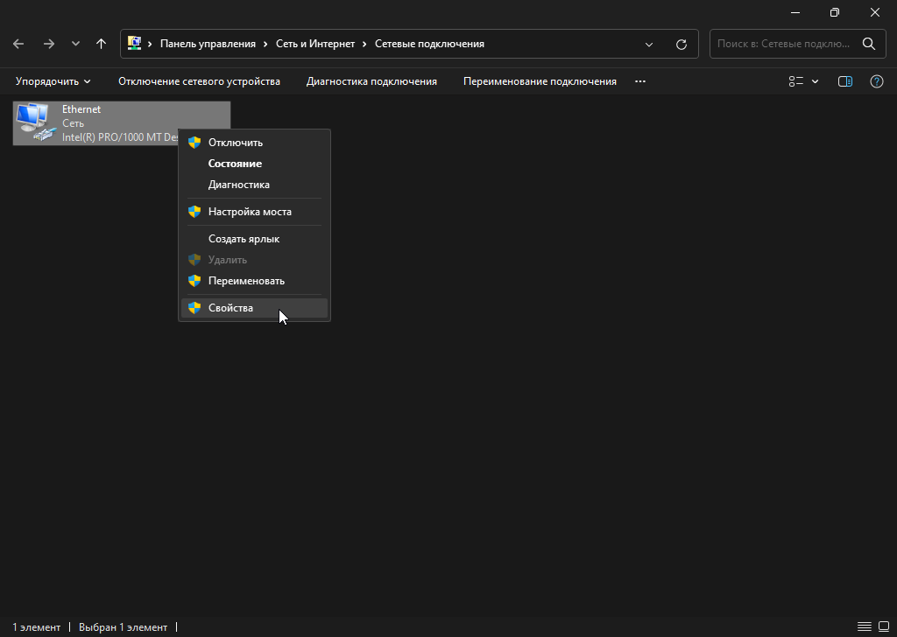
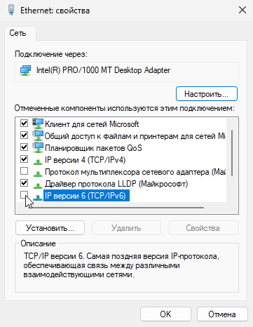

# Недействительный IPv6

Если вы застряли на подключении к мастер-серверу, и когда вы пытаетесь проверить его работоспособность посредством команды `ping api.battlebit.cloud` в консоли вам выдает неверный IPv6, сделайте следующее:

Windows 10

1. Перейдите в Параметры Windows и нажмите на "Сеть и Интернет".

2. Выберите "Настройка параметров адаптера".

3. Нажмите ПКМ по вашей основной сети, затем выберите "Свойства".

4. Выключите "IP версии 6 (TCP/IPv6)" и нажмите ОК.

Windows 11

1. Перейдите в параметры Windows 11 и нажмите на вкладку "Сеть и Интернет".

2. Нажмите на "Дополнительные сетевые параметры".

3. Чуть ниже нажмите на "Дополнительные параметры сетевого адаптера".

4. Нажмите ПКМ по вашей основной сети, затем выберите "Свойства".

5. Выключите "IP версии 6 (TCP/IPv6)" и нажмите ОК.

