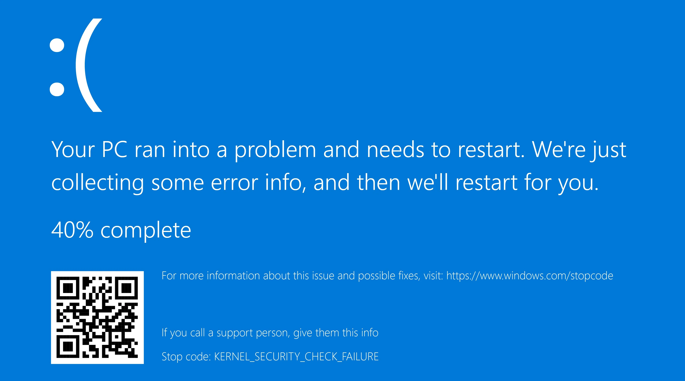

# BSoD on game launch (139)

<figure><figcaption></figcaption></figure>

En général, la cause vient du driver `EasyAntiCheat_EOS.sys`. Pour le réparer, vous devez [run sfc/dism](../other/running-sfc-dism.md) et [EAC Fix batch](https://github.com/livingflore/BattleBitEACFix/releases) (.bat file).
