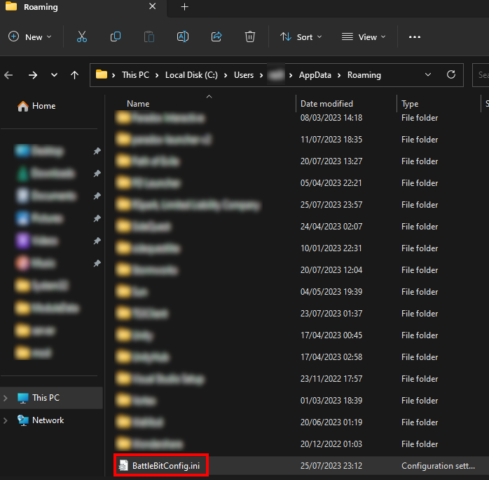

# 🔘 I set my in-game resolution wrong and battlebit keeps crashing

Step 1: Press the windows key + R on your keyboard and type in the "Open" dialog: `%appdata%`

It should look like this:

<figure><figcaption>
Run prompt
</figcaption></figure>

Step 2: In the opened file explorer, search and open a file called "BttleBitConfig.ini":

<figure><figcaption>
Appdata/roaming folder
</figcaption></figure>

Step 3: Find the resolution line and adjust it back to your monitor settings:

<figure><figcaption>
Battlebit config file
</figcaption></figure>

Step 4: Press save, close the file, and restart the game
