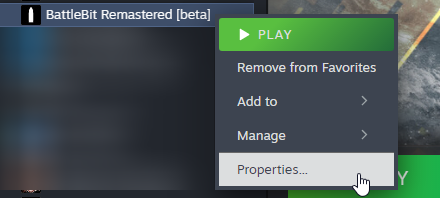
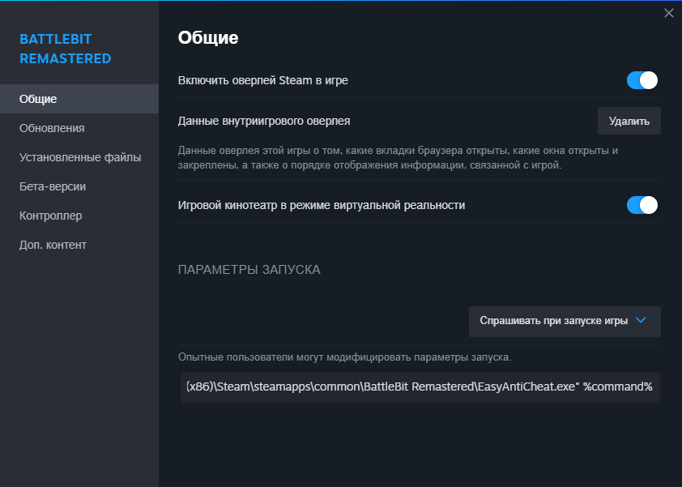

# Запуск из Steam

Если вы испытываете эту проблему:

1. Перейдите к параметрам запуска посредством нажатия ПКМ по игре, затем "Свойства...".

<figure><figcaption></figcaption></figure>

2. Вставьте эту строку в ваши параметры запуска (замените путь к корню игры если он отличается):\
   `"C:\Program Files (x86)\Steam\steamapps\common\BattleBit Remastered\EasyAntiCheat.exe" %command%`

<figure><figcaption>
Должно выглядеть как на скрине. Если путь к корню игры отличается (игра установлена не на диск С) - замените его на актуальный.
</figcaption></figure>
