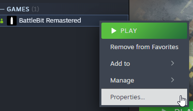

# Pornire din Steam

Dacă întâmpini această problemă:

1. Navighează la "Launch options" apăsând click dreapta pe joc și apăsând "Properties...".

<figure><figcaption></figcaption></figure>

2. Lipește asta în opțiunile tale de pornire (înlocuiește drumul spre joc dacă este diferit):\
   `"C:\Program Files (x86)\Steam\steamapps\common\BattleBit Remastered\EasyAntiCheat.exe" %command%`

<figure><figcaption>
Ar trebui să arate așa. Dacă drumul spre jocul tău diferă - înlocuiește cu actualul tău drum spre joc.
</figcaption></figure>
