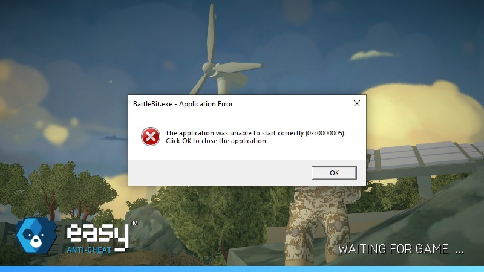
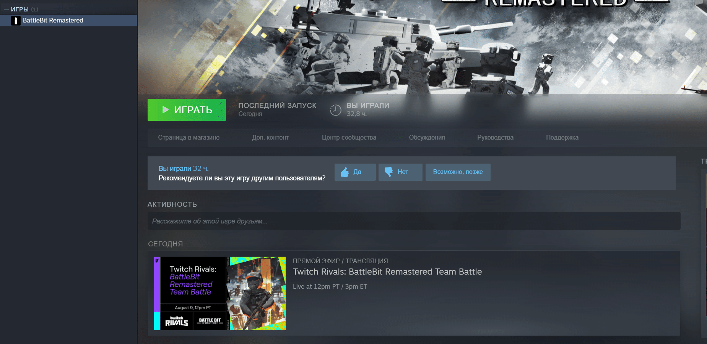

# The application was unable to start correctly (0xc0000005).

<figure><figcaption></figcaption></figure>

1. Dacă îți folosești antivirusul third-party fii sigur că nu intervine cu jocul și adaugă BattleBit și folder-ul EAC la excluse. Dacă nu ajută, șterge-l (în special micro trend-ul)
2. Încearcă să pornești `BattlebitEAC.exe` sau `EasyAntiCheat.exe` ca admin, localizate în fișierul instalat al jocului

<figure><figcaption>
Dă click dreapta pe joc, apoi mergi la "Manage" și dă click pe "Browse local files".
</figcaption></figure>

<figure><figcaption>
Dă click dreapta pe executabil, apoi dă click pe "Run as administrator".
</figcaption></figure>

3. [pornești sfc/dism](../other/running-sfc-dism.md).
4. Închde software-ul de overclocking dacă ai unul
5. Verifică-ți fișierele jocului.

<figure><figcaption>
Dă click dreapta pe joc și apasă "Properties...", Selectează "Installed Files" și apasă "Verify integrity of game files".
</figcaption></figure>

6. Reinstalează jocul în alt drive/partiție
