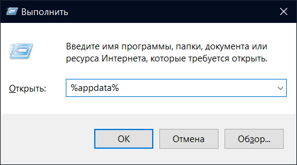

# Mauvaise résolution d'écran

Cette page est pour les utilisateurs qui ont manuellement ajusté leur résolution à une valeur qui fait constamment crash BattleBit pendant le chargement du jeu.
Voici comment le réparer:

1. Ouvrez votre dossier AppData.

<figure><figcaption>
Faites Win+R, tapez <code>%appdata%</code> et Entrez.
</figcaption></figure>

2. Naviguez vers le fichier `BattleBitConfig.ini`.

<figure><figcaption>
Dossier AppData/Roaming
</figcaption></figure>

3. Mettez `customresolution` sur `true` et `customscreenresolution` à votre résolution d'écran actuelle:

<figure><figcaption>
Fichier de configuration de BattleBit
</figcaption></figure>

4. Enregistrez et quittez le fichier.
