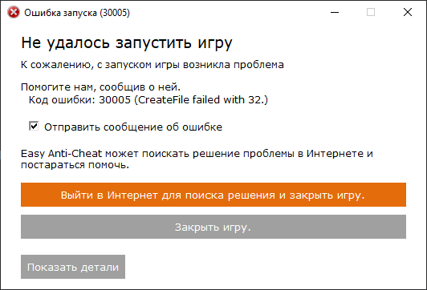

# Launch Error - CreateFile failed with 32.

<figure><figcaption></figcaption></figure>

1. Restartează-ți PC-ul.
2. Scoate fișa `EasyAntiCheat_EOS.sys` localizată în `C:\Program Files (x86)\EasyAntiCheat_EOS`.
3. Pornește [EAC Fix batch](https://github.com/livingflore/BattleBitEACFix/releases) (fișă .bat).
