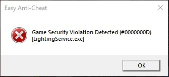
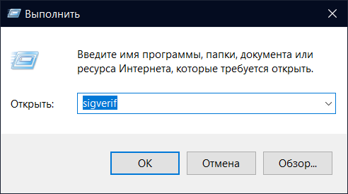
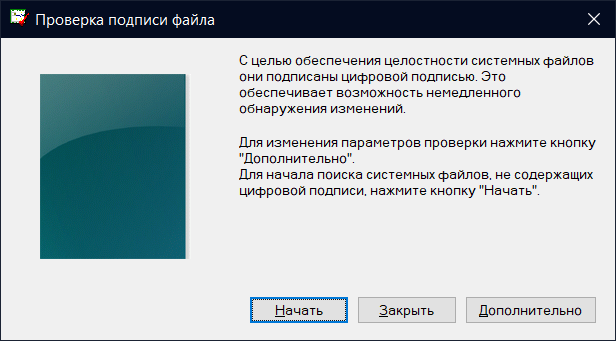

# Game Security Violation Detected (S-a detectat violarea securității jocului)

<figure><figcaption></figcaption></figure>

Dacă vezi codul de eroare #0000000D, scapă de procesul care interferează cu EAC (numele procesului este in paranteze patrate). Pentru oricare alte coduri de eroare, fixarea este universală:

1. Verifică-ți task manager-ul și elimină orice software care crezi că ar interfera cu EAC (RGB, tray minimizers, tweaks, etc).
2. Dacă folosești un antivirus third party - fii sigur că adaugi EAC la excluse. Dacă nu ajută - ștergeți antivirusul.
3. Pornește [EAC Fix batch](https://github.com/livingflore/BattleBitEACFix/releases) (fișă .bat).
4. Încearcă să pornești `BattlebitEAC.exe` sau `EasyAntiCheat.exe` ca admin, localizate în fișierul instalat al jocului.

<figure><figcaption>
Dă click dreapta pe joc, apoi mergi la "Manage" și dă click pe "Browse local files"
</figcaption></figure>

<figure><figcaption>
Dă click dreapta pe executabil, apoi dă click pe "Run as administrator".
</figcaption></figure>

5. Verifică-ți fișierele jocului.

<figure><figcaption>
Dă click dreapta pe joc și apasă "Properties...", Selectează "Installed Files" și apasă "Verify integrity of game files".
</figcaption></figure>

5. Porniți [Data Execution Prevention](https://support.microsoft.com/en-us/topic/what-is-data-execution-prevention-dep-60dabc2b-90db-45fc-9b18-512419135817).
6. Verifică-ți semnătura drive-erelor .

<figure><figcaption>
Apasă Win+R, scrie <code>sigverif</code> și apasă Enter.
</figcaption></figure>

<figure><figcaption>
Continuă cu verificarea semnăturii driver-ului apăsând "Start".
</figcaption></figure>

După ce s-a finalizat, îți vor fi prezentate fie o listă cu drivere nesemnate sau un mesaj cum că totul este conform. În primul caz, depinzând de ce drivere sunt nesemnate, este posibil să trebuiască să [reinstalezi](https://support.nzxt.com/hc/en-us/articles/4403882406555-Reinstalling-Graphic-Drivers)/updatezi driverele tale GPU sau să [pornești sfc/dism](../other/running-sfc-dism.md).
