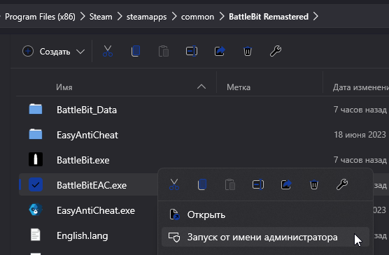

# Game Security Violation Detected

<figure><figcaption></figcaption></figure>

Si vous voyez l'erreur #0000000D, stoppez le processus qui interfère avec EAC (son nom est entre `[]`). Pour les autres codes d'erreur, les réparations sont universelles:

1. Vérifier dans votre gestionnaire des tâches que aucun logiciel n'interfère avec EAC (RGB, tray minimizers, tweaks, etc).
2. si vous utilisez un antivirus autre que Windows defender - pensez à ajouter EAC aux exclusions. Si ça ne fonctionne pas, désactivez l'antivirus.
3. Lancez [EAC Fix batch](https://github.com/livingflore/BattleBitEACFix/releases) (.bat file).
4. Essayez de lancer `BattlebitEAC.exe` ou `EasyAntiCheat.exe` en tant qu'admin, ils sont dans le dossier du jeu.

<figure><figcaption>
Cliquez droit sur le jeu, allez ensuite sur propriétés et Cliquez sur Parcourir les fichiers locaux
</figcaption></figure>

<figure><figcaption>
Cliquez droit sur l'executable et cliquez sur "Lancer en tant qu'administrateur".
</figcaption></figure>

5. Verifiez les fichiers du jeu.

<figure><figcaption>
Cliquez droit sur le jeu and sélectionnez "Propriétés...", Sélectionnez sur l'onglet "Fichiers installés" et "Verifier l'integrité des fichiers du jeu".
</figcaption></figure>

5. Activez [Data Execution Prevention](https://support.microsoft.com/en-us/topic/what-is-data-execution-prevention-dep-60dabc2b-90db-45fc-9b18-512419135817).
6. Vérifiez les signatures des drivers.

<figure><figcaption>
Faites Win+R, tapez <code>sigverif</code> et appuyez sur entrée.
</figcaption></figure>

<figure><figcaption>
Continuez avec la vérification de signatures des driveres en appuyant sur "Commencer".
</figcaption></figure>

Une fois fini,vous aurez une liste de drivers non signés, ou un message disant que tout va bien. Dans le premier cas, en fonction de quels drivers ne sont pas signés, vous devrez [réinstaller](https://support.nzxt.com/hc/en-us/articles/4403882406555-Reinstalling-Graphic-Drivers)/mettre à jour vos drivers de carte graphique ou [run sfc/dism](../other/running-sfc-dism.md).
