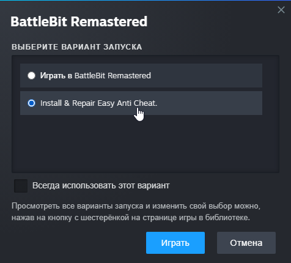
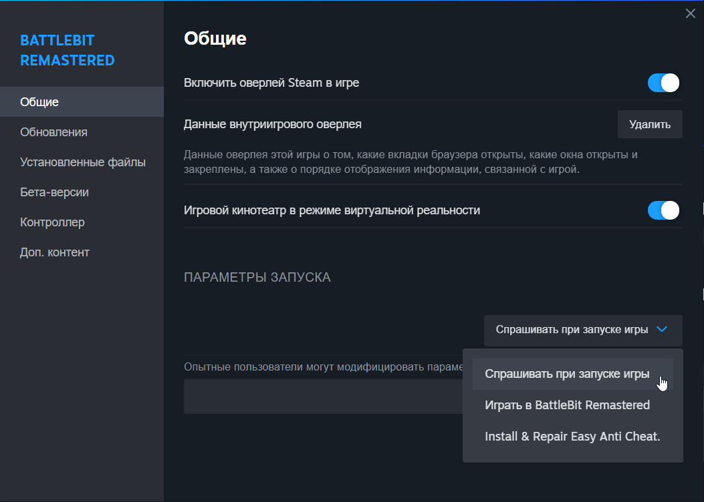

# Erreur de lancement - Easy Anti-Cheat n'est pas installé.

Lancez "Installer & réparer EAC" en option de lancement.

<figure><figcaption></figcaption></figure>

Si vous ne trouvez pas les options de lancement, voici comment faire:

<figure><figcaption>
Cliquez droit sur le jeu and allez sur "Propriétés..."
</figcaption></figure>

<figure><figcaption>
Sélectionnez l'onglet "Général" et en dessous de "Options de lancement" selectionnez "Demander au démarrage du jeu".
</figcaption></figure>
