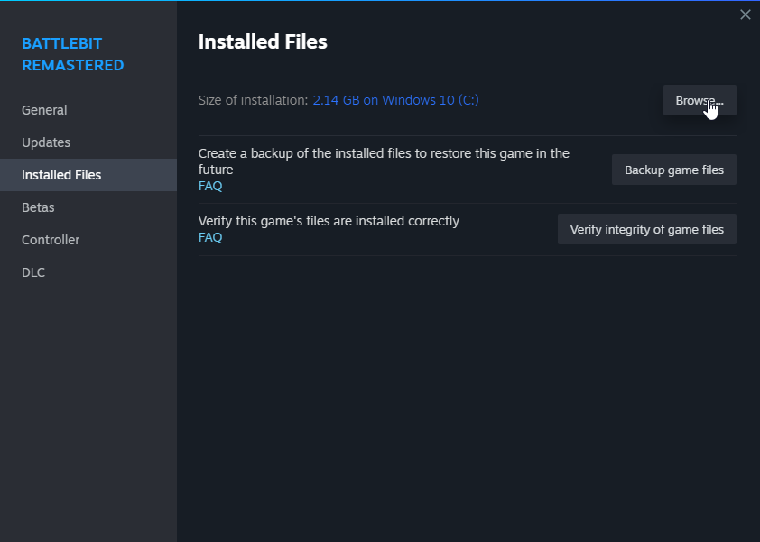
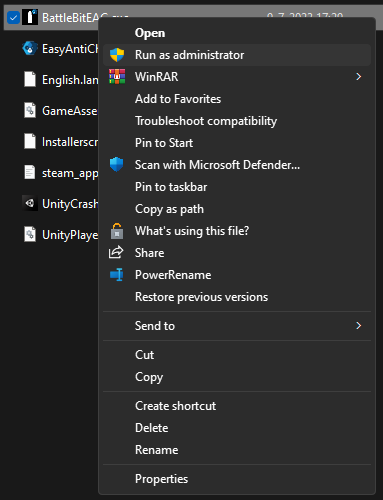
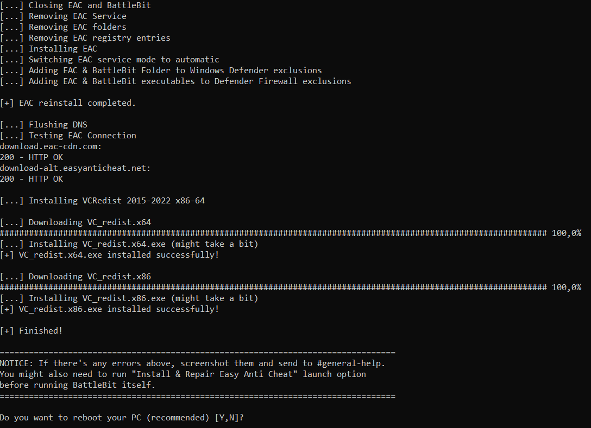
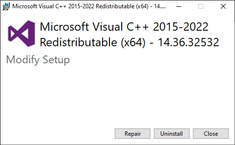
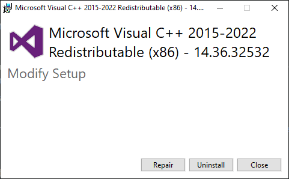

# Vérifiez que vous avez installé EasyAntiCheat and lancez le jeu avec.


Steam est en maintenance tous les Mardis à minuit (GMT+2) . Cette erreur peut apparaître si vous lancez le jeu quand steam est en maintenance.


Etape 1 - Lancer l'exécutable en tant qu'admin

Lancez `BattlebitEAC.exe` ou `EasyAntiCheat.exe` en tant qu'admin, le fichier est situé dans les fichier du jeu.

1. Cliquez droit sur le jeu, allez ensuite sur  "Gérer" et Cliquez sur "Parcourir les fichiers locaux".

2. Cliquez droit sur l'exe et cliquez sur "Exécuter en tant qu'administrateur".

Etape 2 - Lancez le fichier <a href="https://github.com/livingflore/BattleBitEACFix/releases">EAC Fix batch</a>

1. Allez sur [releases page](https://github.com/livingflore/BattleBitEACFix/releases).
2. Téléchargez BattleBitEACFix.bat.
3. LMancez le fichier batch.
4. Vous devriez avoir le résultat ci-dessous.

Etape 3 - VCRedists

Vérifiez que **LES DEUX** VCRedists sont installés correctement - [x86](https://aka.ms/vs/17/release/vc\_redist.x86.exe) et [x64](https://aka.ms/vs/17/release/vc\_redist.x64.exe). En lançant l'installateur, vous verrez 3 buttons - réparer, installer et annuler, comme ci-dessous. Si vous ne voyez pas toutes ces options, installez.

Etape 4 - Problèmes de connexion

Cette erreur peut survenir si vous avez une connexion instable / Steam est en maintenance / vous ne pouvez pas atteindre les serverus d'EAC ou BattleBit.

1. Vérifiez sur Steam si vous êtes en mode hors-ligne.
2. Désactivez la protection anti-malware  et le pare-feu si vous utilisez un autre antivirus (Kaspersky, Avast, etc).
3. Essayez de partager la connexion de votre téléphone pour lancer le jeu. Si le problème est résolu, continuez à la prochaine étape.
4. Utilisez n'importe quel VPN **privé** ou [Cloudflare WARP](https://install.appcenter.ms/orgs/cloudflare/apps/1.1.1.1-windows-1/distribution\_groups/release).

