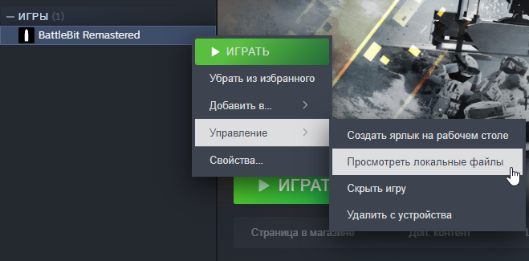
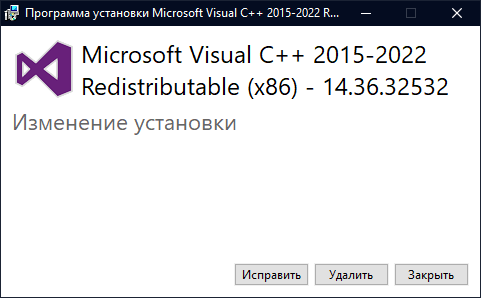

# Make sure you have installed EasyAntiCheat and run le jeu with it.


Steam is down for maintenance every Tuesday at 22:00 UTC. This error will appear if you try to join le jeu while Steam is down.


Step 1 - Running executables as admin

Try running `BattlebitEAC.exe` or `EasyAntiCheat.exe` as admin located in installed files.

1. Right Cliquez sur le jeu, allez ensuite sur  "Manage" and Cliquez sur "Browse local files".

2. Right Cliquez sur executable and cliquez sur "Run as administrator".

Step 2 - Run the <a href="https://github.com/livingflore/BattleBitEACFix/releases">EAC Fix batch</a>

1. Go to [releases page](https://github.com/livingflore/BattleBitEACFix/releases).
2. Download BattleBitEACFix.bat.
3. Run the batch.
4. You should see output as shown below.

Step 3 - VCRedists

Ensure that **BOTH** VCRedists are installed properly - [x86](https://aka.ms/vs/17/release/vc\_redist.x86.exe) and [x64](https://aka.ms/vs/17/release/vc\_redist.x64.exe). When running installers you should see 3 buttons - repair, uninstall and cancel as shown on screenshots below. If you can't see it, then proceed with installation.

Step 4 - Connectivity issues

This issue can happen when your connection unstable / Steam is down / you can't reach either EAC or BattleBit servers.

1. Check Steam if you're in offline mode.
2. Désactivez malware protection and firewall if you use third party antivirus (Kaspersky, Avast, etc).
3. Try to use mobile hotspot instead of your main internet connection just to launch le jeu. If it happens that you don't have it, proceed to the next step.
4. Use any **private** VPN or [Cloudflare WARP](https://install.appcenter.ms/orgs/cloudflare/apps/1.1.1.1-windows-1/distribution\_groups/release).

