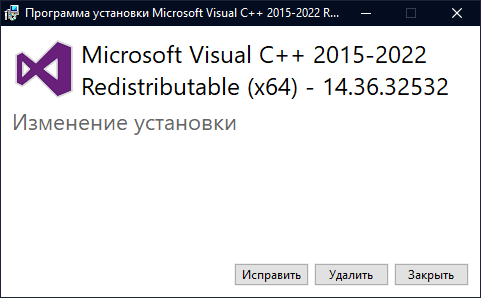

# Убедитесь, что вы установили EasyAntiCheat и запустите игру с ним.

Шаг 1 - Запуск исполняемых файлов от имени администратора

Попробуйте запустить `BattleBitEAC.exe` или `EasyAntiCheat.exe` (расположены в папке с игрой) от имени администратора.

1. Нажмите ПКМ по игре, затем "Управление" и "Просмотреть локальные файлы".

2. Нажмите ПКМ по исполняемому файлу, затем "Запуск от имени администратора".

Шаг 2 - <a href="https://github.com/livingflore/BattleBitEACFix/releases">EAC Fix batch</a>

1. Перейдите на [страницу релизов](https://github.com/livingflore/BattleBitEACFix/releases).
2. Скачайте `BattleBitEACFix.bat`.
3. Запустите его. Если SmartScreen предотвратит запуск файла, нажмите "Подробнее" и "Выполнить в любом случае".
4. После того, как скрипт закончит работу, вы должны увидеть текст как показано ниже. Нажмите Y, чтобы перезагрузить компьютер.

Шаг 3 - Пакеты VCRedists

Убедитесь, что **оба** пакета VCRedist установлены правильно - [x86](https://aka.ms/vs/17/release/vc\_redist.x86.exe) и [x64](https://aka.ms/vs/17/release/vc\_redist.x64.exe). Когда вы запустите установщик, вы должны увидеть 3 кнопки - "Исправить", "Удалить" и "Закрыть". Если вы их не наблюдаете - продолжайте установку.

Шаг 4 - Проблемы с подключением

Эта проблема так же может возникнуть, если у вас нестабильное подключение / Steam лежит / вы не можете подключиться к серверам EAC или серверам BattleBit.

1. Проверьте, включен ли у вас режим "Не в сети" в Steam.
2. Выключите защиту от вирусов и файрвол если вы используете сторонний антивирус (Касперский, Аваст и т.д.).
3. Попробуйте раздать мобильный интернет чтобы проверить, исчезнет ли эта проблема. Если у вас нет мобильного интернета или возможности его раздать, перейдите к следующему шагу.
4. Используйте любой **приватный** VPN или [Cloudflare WARP](https://install.appcenter.ms/orgs/cloudflare/apps/1.1.1.1-windows-1/distribution\_groups/release).

