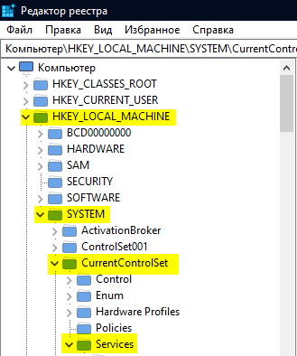

# Launch Error - StartService EasyAntiCheat\_EOSSys failed with 5.

<figure><figcaption></figcaption></figure>

1. Pornește [EAC Fix batch](https://github.com/livingflore/BattleBitEACFix/releases) (fișă .bat).
2. Permite accesul total la EAC pentru aplicarea pachetelor în registru.

<figure><figcaption>
Apasă Win+R, scrie <code>regedit.exe</code> și apasă Enter
</figcaption></figure>

<figure><figcaption>
Apasă Da.
</figcaption></figure>

<figure><figcaption>
Du-te la <code>HKEY_LOCAL_MACHINE\SYSTEM\CurrentControlSet\Services\EasyAntiCheat_EOS</code>.
</figcaption></figure>

<figure><figcaption>
Apasă click dreapta pe <code>EasyAntiCheat_EOS</code>.
</figcaption></figure>

<figure><figcaption>
Apasă "Allow" la checkbox-ul pentru "Full Control" sub grupul "ALL APPLICATION PACKAGES".
</figcaption></figure>
