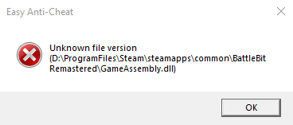

# Unknown file version

<figure><figcaption></figcaption></figure>

1. Redémarrez votre PC.
2. Verifiez les fichiers du jeu.

<figure><figcaption>
Cliquez droit sur le jeu et appuyez sur "Propriétés...", Sélectionnez l'onglet "Fichiers installés" et cliquez sur "Verifier l'intégrité des fichiers du jeu".
</figcaption></figure>
