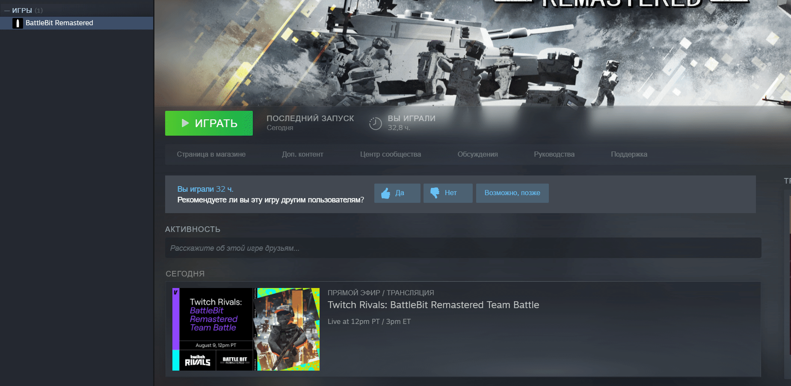

# Unknown file version

<figure><figcaption></figcaption></figure>

1. Перезагрузите ваш ПК.
2. Проверьте целостность файлов игры.

<figure><figcaption>
Нажмите ПКМ по игре, затем "Свойства...", перейдите во вкладку "Установленные файлы" и нажмите "Проверить целостность файлов игры".
</figcaption></figure>
