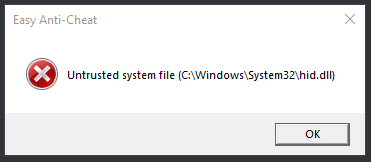

# Untrusted system file (fișă de sistem de neîncredere)

<figure><figcaption></figcaption></figure>

Depinzând de ce driver a cauzat asta, s-ar putea să ai nevoie să [reinstalezi](https://support.nzxt.com/hc/en-us/articles/4403882406555-Reinstalling-Graphic-Drivers)/updatezi driverele GPU ale tale sau să [pornești sfc/dism](../other/running-sfc-dism.md).
