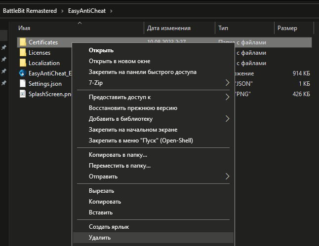

# Вы были исключены из игры античит службой.

1. Если вы заменили файл English.lang в корне игры - удалите его и проверьте целостность файлов игры.
2. Убедитесь, что у вас нету записей с доменами EAC в файле hosts (`etc/hosts` или `C:\Windows\System32\drivers\etc\hosts`), которые были необходимы для работы некоторых игр (например Star Citizen).
3. Запустите [EAC Fix batch](https://github.com/livingflore/BattleBitEACFix/releases) (файл BattleBitEACFix.bat).
4. Убедитесь, что абсолютно **НИЧЕГО** не блокирует подключение EAC (антивирус/файрвол/провайдер).
5. Удалите папку `Certificates` в папке `EasyAntiCheat` (корень игры) и проверьте целостность файлов.

<figure><figcaption>
Нажмите ПКМ по игре, затем "Управление" и "Просмотреть локальные файлы"
</figcaption></figure>

<figure><figcaption>
Проследуйте к папке <code>EasyAntiCheat</code> и удалите папку <code>Certificates</code>
</figcaption></figure>

<figure><figcaption>
Нажмите ПКМ по игре, затем "Свойства...", перейдите во вкладку "Установленные файлы" и нажмите "Проверить целостность файлов игры".
</figcaption></figure>

6. Поменяйте свой IP путем перезагрузки роутера или используйте приватный VPN/[Cloudflare WARP](https://1.1.1.1).
7. Проверьте [последние обновления Windows](ms-settings:windowsupdate-history). Если вы начали испытывать эту проблему после какого-то определенного обновления, нажмите ПКМ по нему и удалите его.
