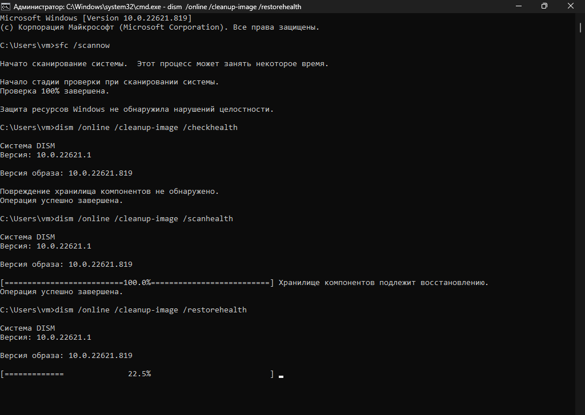

# Pornire sfc/dism

1. Pornește "command prompt" ca administrator.

<figure><figcaption>
Scrie <code>cmd.exe</code> în search și apasă "Run as administrator".
</figcaption></figure>

2. Pornește următoarele comenzi în ordinea:\
   `sfc /scannow`\
   `dism /online /cleanup-image /checkhealth`\
   `dism /online /cleanup-image /scanhealth`\
   `dism /online /cleanup-image /restorehealth`

<figure><figcaption>
Așa trebuie să arate ”command prompt” după ce ambele sfc și dism sunt finisate.
</figcaption></figure>

3. După ce s-a terminat, adițional poți folosi `chkdsk /f /r /x` pentru a-ți verifica drive-ul pentru eventuale corupții

<figure><figcaption></figcaption></figure>

După ce apeși Y, restartează-ți PC-ul

<figure><figcaption></figcaption></figure>
