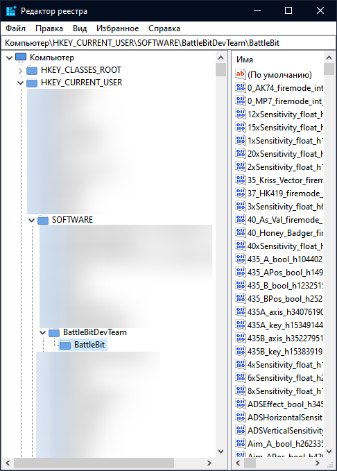
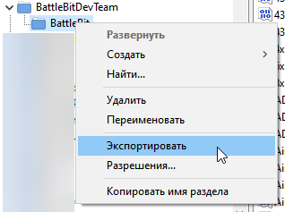

# Сохраняем все настройки в один файл

1. Откройте редактор реестра.

<figure><figcaption>
Нажмите Win+R, введите <code>regedit.exe</code> и нажмите Enter.
</figcaption></figure>

2. Проследуйте по пути `HKEY_CURRENT_USER\SOFTWARE\BattleBitDevTeam\BattleBit`.

<figure><figcaption></figcaption></figure>

3. Нажмите ПКМ по папке `BattleBit`, а затем "Экспортировать".

<figure><figcaption></figcaption></figure>

4. Сохраните этот файл. Когда вы захотите восстановить настройки, просто запустите его.
