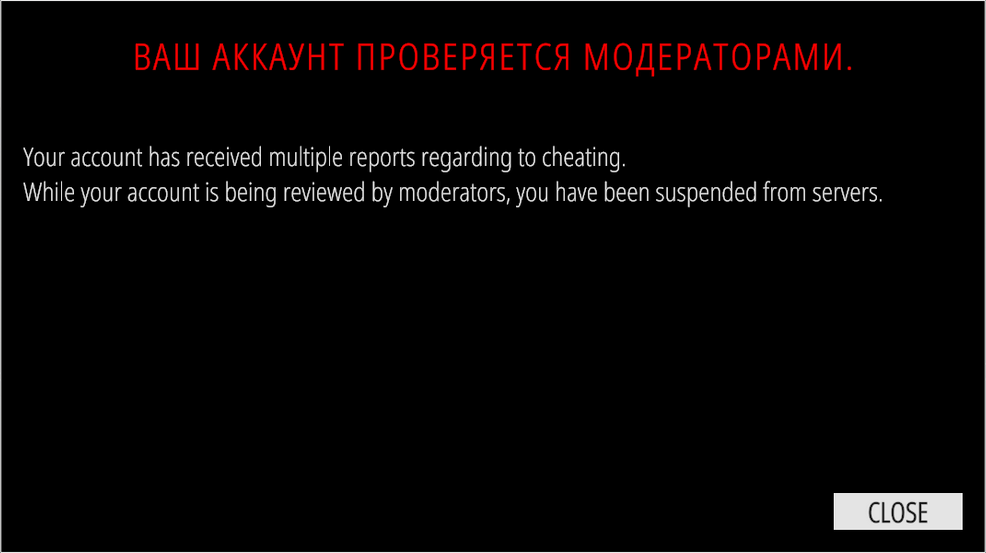

---
layout:
  title:
    visible: true
  description:
    visible: false
  tableOfContents:
    visible: true
  outline:
    visible: true
  pagination:
    visible: true
---

# Votre compte est en cours de vérification par des modérateurs.

<figure><figcaption></figcaption></figure>

**Premièrement - soyez patient, çela peut prendre plusieurs heures.**

Ce n'est pas un ban, mais un timeout, et peut être levé après qu'un modérateur ait examiné votre dossier. Il y a plusieurs raisons possibles pour que le système vous ait mis un timeout, tel que un montant anormal de reports.\
\
**Cela peut encore arriver**, même après vérification de votre dossier. Nous sachons que le système n'est pas parfait, et les développeurs cherchent déjà une solution pour l'améliorer.